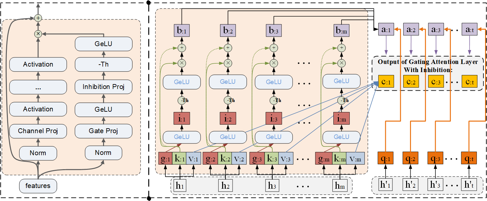

# giMLP in Transformers and CNNs

giMLPs: Gate with Inhibition Mechanism in MLPs

## What's New:

- (05/08/2022) Added manuals about [giMLPs On CNNs On ImageNet Classification](/giMLP_CNN/README.md) and [giMLPs on Transformers On Downstream Language Tasks Fine-Tuning 
](/giMLP_Transformers/README.md).
- (04/08/2022) Initial release.

## Introduction

The major challenge for fine-tuning downstream NLU tasks is to select proper features in dense feature pools. That requires (1) pretraining on huge language datasets again, (2) branch pathways on features selection, and meanwhile, (3) capacity on discard or inhibit trivial features. In [PaLM](https://github.com/lucidrains/PaLM-pytorch), MLP branches are used to select trunk features, and the activation function SwiGLU is applied on gating MLPs and attention blocks. Thus, in this paper, we seek to answer this question: can we improve language models by avoiding every time pretraining on huge language datasets, and improve Transformer models sparsity, and keep architecture efficiency, as well as maintaining higher prediction capacity? To address the first challenge, we directly apply several pretrained language models on fine-tuning downstream NLU tasks. As illustrated in the Figure, for the second and the last issues, we construct a gating MLP branch architecture on Transformers to select features, meanwhile, propose an adaptive threshold as an inhibition level to adjust the gating branch weights.

 

## [giMLPs On CNNs On ImageNet Classification](/giMLP_CNN/README.md) 

## [giMLPs on Transformers On Downstream Language Tasks Fine-Tuning](/giMLP_Transformers/README.md)
